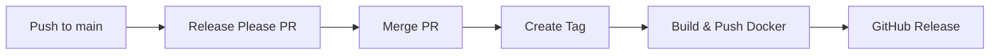

<p align="center">
  <h1 align="center">FFO Discord Bot</h1>
  <p align="center">
    High-availability Discord bot for automated reactions, media archival, and community management.
  </p>
</p>

<p align="center">
  <a href="https://github.com/MrCurlsTTV/ffo-bot/actions/workflows/ci.yml"></a>
  <a href="https://codecov.io/github/MrCurlsTTV/ffo-bot"></a>
  <a href="https://www.python.org/downloads/"></a>
  <a href="LICENSE"></a>
  <a href="https://github.com/MrCurlsTTV/ffo-bot/pkgs/container/ffo-bot"></a>
</p>

---

## Features

| Feature | Description |
|---------|-------------|
| 🤖 **Automated Reactions** | Configure regex patterns to automatically react to messages |
| 📁 **Media Archival** | Download and archive media from monitored channels |
| 🔔 **Notifiarr Monitoring** | Monitor Notifiarr notifications and alert on failures |
| 👥 **Reaction Roles** | Self-service role assignment via reactions |
| 🔐 **Granular Permissions** | Role-based access control (super admin, admin, moderator) |
| 📊 **Prometheus Metrics** | Comprehensive observability and monitoring |
| 🏥 **Health Checks** | Kubernetes-ready liveness and readiness probes |
| 🔄 **High Availability** | Active-active deployment with 99% uptime target |

---

## Quick Start

```bash
docker pull ghcr.io/mrcurlsttv/ffo-bot:latest
```

<details>
<summary><b>📦 Docker Compose (Recommended)</b></summary>

```bash
# Clone and configure
git clone https://github.com/MrCurlsTTV/ffo-bot.git
cd ffo-bot/examples/docker-compose
cp .env.example .env
# Edit .env with your credentials

# Run migrations and start
docker compose run --rm ffo-bot alembic upgrade head
docker compose up -d
```

See [examples/docker-compose/](examples/docker-compose/) for full documentation.

</details>

<details>
<summary><b>☸️ Kubernetes</b></summary>

```bash
kubectl apply -f examples/kubernetes/
```

See [examples/kubernetes/](examples/kubernetes/) for full documentation including secrets, configmaps, and ServiceMonitor.

</details>

<details>
<summary><b>🐍 Local Development</b></summary>

### Prerequisites

- Python 3.12+
- PostgreSQL 16+
- Discord Bot Token

### Setup

```bash
# Clone repository
git clone https://github.com/MrCurlsTTV/ffo-bot.git
cd ffo-bot

# Create virtual environment
python3.12 -m venv venv
source venv/bin/activate

# Install dependencies
pip install -r requirements.txt
pip install -r requirements-dev.txt

# Configure environment
cp .env.example .env
# Edit .env with your Discord credentials

# Start PostgreSQL
docker-compose up -d postgres

# Run migrations
alembic upgrade head

# Start the bot
python main.py
```

</details>

---

## Configuration

<details>
<summary><b>Environment Variables</b></summary>

### Required

| Variable | Description |
|----------|-------------|
| `DISCORD_BOT_TOKEN` | Discord bot token |
| `DISCORD_PUBLIC_KEY` | Discord application public key |
| `DATABASE_URL` | PostgreSQL connection string |

### Optional

| Variable | Default | Description |
|----------|---------|-------------|
| `LOG_LEVEL` | `INFO` | Logging level (DEBUG, INFO, WARNING, ERROR) |
| `LOG_FORMAT` | `json` | Log format (json, text) |
| `HEALTH_CHECK_PORT` | `8080` | Health/metrics server port |
| `FEATURE_MEDIA_DOWNLOAD` | `false` | Enable media archival |
| `FEATURE_NOTIFIARR_MONITORING` | `false` | Enable Notifiarr monitoring |
| `RATE_LIMIT_USER_CAPACITY` | `10` | Rate limit tokens per user |
| `RATE_LIMIT_SERVER_CAPACITY` | `100` | Rate limit tokens per server |
| `CACHE_MAX_SIZE` | `10000` | Maximum cache entries |
| `CACHE_DEFAULT_TTL` | `300` | Cache TTL in seconds |
| `DB_POOL_MIN_SIZE` | `2` | Minimum database connections |
| `DB_POOL_MAX_SIZE` | `10` | Maximum database connections |

</details>

<details>
<summary><b>Monitoring Endpoints</b></summary>

The bot exposes endpoints on port 8080:

| Endpoint | Description |
|----------|-------------|
| `/healthz` | Liveness probe |
| `/readyz` | Readiness probe |
| `/metrics` | Prometheus metrics |

</details>

---

## Development

<details>
<summary><b>Testing</b></summary>

Run the test suite (196 tests, ~86% coverage):

```bash
# All tests with coverage
pytest tests/ -v --cov=bot --cov=config --cov=database --cov-report=html

# Unit tests only
pytest tests/unit/ -v

# Integration tests only
pytest tests/integration/ -v

# Full build (linting + tests + Docker)
./build.sh
```

</details>

<details>
<summary><b>Project Structure</b></summary>

```
ffo-bot/
├── bot/                    # Bot application code
│   ├── auth/              # Authentication and permissions
│   ├── cache/             # In-memory caching
│   ├── commands/          # Slash commands
│   ├── handlers/          # Event handlers
│   ├── processors/        # Message processors
│   └── utils/             # Utilities and helpers
├── config/                # Configuration management
├── database/              # Database layer and migrations
├── examples/              # Deployment examples
│   ├── docker-compose/   # Docker Compose setup
│   └── kubernetes/       # Kubernetes manifests
├── tests/                 # Test suite
└── .github/workflows/     # CI/CD pipelines
```

</details>

<details>
<summary><b>CI/CD Workflows</b></summary>

| Workflow | Trigger | Description |
|----------|---------|-------------|
| **CI** | Push/PR | Linting, tests, coverage, Docker build |
| **Nightly** | Daily 00:00 UTC | Build and push `:nightly` image |
| **Release Please** | Push to main | Automated semantic versioning |
| **Auto-merge** | Renovate PRs | Auto-merge dependency updates |

### Commit Convention

Use [Conventional Commits](https://www.conventionalcommits.org/) for automatic versioning:

| Prefix | Version Bump | Example |
|--------|--------------|---------|
| `fix:` | Patch (0.0.x) | `fix: resolve database timeout` |
| `feat:` | Minor (0.x.0) | `feat: add new slash command` |
| `feat!:` | Major (x.0.0) | `feat!: change API format` |

### Release Flow



</details>

---

## Security

| Protection | Implementation |
|------------|----------------|
| Input Validation | Comprehensive sanitization on all inputs |
| SQL Injection | Parameterized queries only |
| ReDoS | Regex pattern validation and timeout |
| Rate Limiting | Per-user and per-server token buckets |
| Audit Logging | All administrative actions logged |
| Secrets | Encrypted with SOPS |

---

## Contributing

1. Fork the repository
2. Create a feature branch (`git checkout -b feat/amazing-feature`)
3. Make your changes with tests
4. Run `./build.sh` to verify
5. Commit using conventional commits (`git commit -m 'feat: add amazing feature'`)
6. Push and open a Pull Request

---

## License

This project is licensed under [CC BY-NC-SA 4.0](https://creativecommons.org/licenses/by-nc-sa/4.0/).

- ✅ Personal use
- ✅ Modification
- ✅ Distribution (with attribution, same license)
- ❌ Commercial use

See [LICENSE](LICENSE) for details.

---

<p align="center">
  <sub>Built with ❤️ by <a href="https://github.com/MrCurlsTTV">MrCurlsTTV</a></sub>
</p>
